# Offaways — Filing Management Portal

A form filing & management portal built using the Serverless Framework with Lambda (Node 20), Aurora Serverless v2 PostgreSQL, Cognito auth, and a vanilla-JS frontend on CloudFront/S3. Currently supports SEC Form N-PX (annual proxy voting record).

---

## Local Development

### Prerequisites
- Docker + Docker Compose (or Podman Compose)
- Node 20 (for running scripts outside Docker)

### Start (fresh database)

```bash
docker compose up --build
```

### Start (preserve existing data)

```bash
docker compose down && docker compose up -d
```

### Wipe database and start fresh

```bash
docker compose down -v && docker compose up -d
```

| Service  | URL                                         |
|----------|---------------------------------------------|
| Frontend | http://localhost:8080                       |
| API      | http://localhost:3000                       |
| Postgres | localhost:5432 (db: `offaways`, user: `offaways_dev`) |

The database schema is applied automatically on first run via the Docker volume mount.

### Create an admin user (local)

```bash
cd backend
npm install
node scripts/create-admin.js admin@example.com password123
```

Then sign in at http://localhost:8080/login.html.

---

## Project Structure

```
offaways/
├── docker-compose.yml
├── nginx.conf
├── backend/
│   ├── serverless.yml              # AWS infrastructure + Lambda functions
│   ├── package.json
│   ├── Dockerfile.local
│   ├── .env.local                  # Local env vars (gitignored)
│   ├── scripts/
│   │   ├── create-admin.js         # Create/promote admin user
│   │   └── migrate-npx.js          # Run N-PX schema migration
│   └── src/
│       ├── local.js                # Express server (local dev entry point)
│       ├── handlers/
│       │   ├── auth.js             # Login handler (local dev only)
│       │   ├── cognito-config.js   # Cognito config endpoint
│       │   ├── filings.js          # N-PX filing CRUD + status transitions
│       │   ├── series.js           # Fund series CRUD (RMIC filers)
│       │   ├── proxy-votes.js      # Proxy vote CRUD + CSV import
│       │   ├── users.js            # Admin user management
│       │   └── setup.js            # Database schema initializer (Lambda)
│       ├── db/
│       │   ├── client.js           # PostgreSQL pool
│       │   ├── schema.sql          # Full database schema
│       │   └── migrations/
│       │       └── 001-npx-schema.sql  # Migration from legacy schema
│       ├── utils/
│       │   ├── auth.js             # JWT & Cognito user resolution
│       │   ├── csv-parser.js       # CSV parser for proxy vote imports
│       │   ├── filing-helpers.js   # Filing ownership verification
│       │   └── response.js         # Lambda response helpers
│       └── __tests__/
│           ├── setup.js            # Jest configuration
│           ├── helpers.js          # Test utilities
│           ├── handlers/
│           │   ├── filings.test.js
│           │   ├── series.test.js
│           │   ├── proxy-votes.test.js
│           │   └── users.test.js
│           └── utils/
│               ├── auth.test.js
│               ├── csv-parser.test.js
│               └── response.test.js
└── frontend/
    ├── login.html
    ├── index.html                  # Filings list
    ├── new-filing.html             # Form type selection
    ├── filing.html                 # N-PX filing form (4-step wizard)
    ├── admin.html                  # Admin user management panel
    ├── user.html                   # Create / edit user
    ├── css/styles.css
    └── js/
        ├── config.js               # Auto-detects local vs prod
        ├── auth.js                 # Local JWT or Cognito SDK
        ├── api.js                  # Fetch wrapper
        ├── utils.js                # HTML escaping utility
        ├── login.js
        ├── app.js                  # Filings list logic
        ├── filing.js               # N-PX filing form logic
        ├── admin.js
        └── user.js
```

---

## Form N-PX Filing Workflow

Creating or editing a filing follows a 4-step wizard:

1. **Cover Page** — Filer type (RMIC/IM), report type (N-PX / N-PX/A), period, filer identity, and agent for service of process. Save data and continue.
2. **Series** — Fund series table (RMIC filers only). Add/edit/delete series via modal. IM filers see an informational notice.
3. **Proxy Votes** — Paginated table of proxy votes (50/page). Add votes manually via modal or bulk-import from CSV. Each vote supports multiple vote records (how voted, management recommendation, shares).
4. **Signature** — Signatory name, title, and date. The **Submit Filing** button saves the signature and marks the filing as `complete` after a confirmation dialog.

**Status lifecycle:**
- `draft` — editable, all steps are open
- `complete` — read-only; the **Return to Draft** button (in the page header) re-enables editing

**Edit mode** — clicking Edit from the filings list opens the wizard with all steps immediately accessible (jump to any step via the progress trail). The filing's 8-character ID is shown below the page title.

---

## API Endpoints

### Auth
| Method | Path          | Auth | Description             |
|--------|---------------|------|-------------------------|
| POST   | /auth/login   | None | Local dev login         |
| GET    | /config       | None | Cognito config (prod)   |

### Filings
| Method | Path                     | Auth  | Description                                      |
|--------|--------------------------|-------|--------------------------------------------------|
| GET    | /filings                 | User  | List own filings (admin sees all)                |
| POST   | /filings                 | User  | Create draft filing                              |
| GET    | /filings/:id             | User  | Get filing with embedded series + vote count     |
| PUT    | /filings/:id             | User  | Update cover page / signature fields             |
| DELETE | /filings/:id             | User  | Delete filing (cascades to series + votes)       |
| PUT    | /filings/:id/status      | User  | Transition status: `draft` ↔ `complete`          |

`PUT /filings/:id/status` with `{"status":"complete"}` validates that all required fields are present (`filer_name`, `filer_street1`, `filer_city`, `filer_state`, `filer_zip`, `period_start`, `period_end`, `signatory_name`, `signatory_title`, `signature_date`) before transitioning.

### Series (RMIC filers)
| Method | Path                              | Auth | Description       |
|--------|-----------------------------------|------|-------------------|
| GET    | /filings/:filingId/series         | User | List series       |
| POST   | /filings/:filingId/series         | User | Create series     |
| PUT    | /filings/:filingId/series/:id     | User | Update series     |
| DELETE | /filings/:filingId/series/:id     | User | Delete series     |

### Proxy Votes
| Method | Path                               | Auth | Description                            |
|--------|------------------------------------|------|----------------------------------------|
| GET    | /filings/:filingId/votes           | User | List votes (paginated, with records)   |
| POST   | /filings/:filingId/votes           | User | Create vote + vote records             |
| PUT    | /filings/:filingId/votes/:id       | User | Update vote + replace vote records     |
| DELETE | /filings/:filingId/votes/:id       | User | Delete vote                            |
| POST   | /filings/:filingId/votes/import    | User | Bulk CSV import `{ csv: "..." }`       |
| DELETE | /filings/:filingId/votes           | User | Clear all votes for filing             |

### Admin Users
| Method | Path               | Auth  | Description     |
|--------|--------------------|-------|-----------------|
| GET    | /admin/users       | Admin | List all users  |
| POST   | /admin/users       | Admin | Create user     |
| GET    | /admin/users/:id   | Admin | Get user        |
| PUT    | /admin/users/:id   | Admin | Update user     |
| DELETE | /admin/users/:id   | Admin | Delete user     |

---

## Database Schema

Five tables with UUID primary keys, `created_at`/`updated_at` timestamps (auto-updated via triggers), and cascading deletes.

```mermaid
erDiagram
    users {
        UUID id PK
        VARCHAR cognito_sub
        VARCHAR email
        VARCHAR password_hash
        VARCHAR first_name
        VARCHAR last_name
        VARCHAR role
        BOOLEAN is_active
        TIMESTAMPTZ created_at
        TIMESTAMPTZ updated_at
    }

    npx_filings {
        UUID id PK
        UUID user_id FK
        VARCHAR status
        VARCHAR filer_type
        VARCHAR report_type
        DATE period_start
        DATE period_end
        INTEGER amendment_number
        VARCHAR amendment_type
        VARCHAR filer_name
        VARCHAR filer_cik
        VARCHAR filer_lei
        VARCHAR filer_crd
        VARCHAR filer_city
        VARCHAR filer_state
        VARCHAR filer_zip
        VARCHAR filer_country
        VARCHAR agent_name
        VARCHAR signatory_name
        VARCHAR signatory_title
        DATE signature_date
        TIMESTAMPTZ created_at
        TIMESTAMPTZ updated_at
    }

    npx_filing_series {
        UUID id PK
        UUID filing_id FK
        VARCHAR series_id
        VARCHAR series_name
        VARCHAR series_lei
        INTEGER sort_order
        TIMESTAMPTZ created_at
        TIMESTAMPTZ updated_at
    }

    npx_proxy_votes {
        UUID id PK
        UUID filing_id FK
        UUID series_id FK
        VARCHAR issuer_name
        VARCHAR cusip
        VARCHAR isin
        VARCHAR figi
        DATE meeting_date
        VARCHAR meeting_type
        TEXT vote_description
        VARCHAR vote_source
        VARCHAR vote_category
        NUMERIC shares_voted
        NUMERIC shares_on_loan
        INTEGER sort_order
        TIMESTAMPTZ created_at
        TIMESTAMPTZ updated_at
    }

    npx_vote_records {
        UUID id PK
        UUID proxy_vote_id FK
        VARCHAR how_voted
        VARCHAR mgmt_recommendation
        NUMERIC shares
        INTEGER sort_order
        TIMESTAMPTZ created_at
        TIMESTAMPTZ updated_at
    }

    users ||--o{ npx_filings : "owns"
    npx_filings ||--o{ npx_filing_series : "has (RMIC only)"
    npx_filings ||--o{ npx_proxy_votes : "contains"
    npx_filing_series |o--o{ npx_proxy_votes : "scoped to"
    npx_proxy_votes ||--o{ npx_vote_records : "voted as"
```



### `users`
Core user accounts. Stores both a `password_hash` (local dev) and `cognito_sub` (production).

### `npx_filings`
One record per filing. Holds the cover page, filer identity, agent for service of process, and signature fields. Key columns: `status` (`draft`|`complete`), `filer_type` (`RMIC`|`IM`), `report_type` (`NPX`|`NPX-A`).

### `npx_filing_series`
Fund series belonging to a filing. Only applicable to RMIC filers. Columns: `series_id`, `series_name`, `series_lei`, `sort_order`.

### `npx_proxy_votes`
One record per issuer/meeting/proposal combination. Columns: `issuer_name`, `cusip`, `isin`, `figi`, `meeting_date`, `meeting_type`, `vote_description`, `vote_source`, `vote_category`, `shares_voted`, `shares_on_loan`, `sort_order`.

### `npx_vote_records`
One or more records per proxy vote indicating how shares were cast. Columns: `how_voted` (`for`|`against`|`abstain`|`withhold`|`not_voted`), `mgmt_recommendation`, `shares`, `sort_order`.

---

## CSV Import Format

The proxy vote CSV import groups rows by `issuer_name + meeting_date + vote_description`. Each row represents one vote record; multiple rows with the same key produce multiple vote records under a single proxy vote.

Required/optional columns:

| Column               | Notes                                   |
|----------------------|-----------------------------------------|
| `issuer_name`        | Groups rows into a single proxy vote    |
| `cusip`              | Optional security identifier            |
| `isin`               | Optional security identifier            |
| `figi`               | Optional security identifier            |
| `meeting_date`       | YYYY-MM-DD                              |
| `meeting_type`       | Annual / Special / Other                |
| `vote_description`   | Groups rows into a single proxy vote    |
| `vote_source`        | Optional                                |
| `vote_category`      | Optional                                |
| `shares_voted`       | Optional numeric                        |
| `shares_on_loan`     | Optional numeric                        |
| `how_voted`          | for / against / abstain / withhold / not_voted |
| `mgmt_recommendation`| for / against / abstain / withhold / none |
| `shares`             | Shares for this vote record             |

Download a blank template from the Proxy Votes step in the filing wizard.

---

## Auth Flow

### Local dev
- `POST /auth/login` → verifies bcrypt hash, returns JWT signed with `JWT_SECRET`
- JWT payload: `sub` (DB UUID), `email`, `role`, `cognito:groups` (for compatibility)
- `AUTH.requireAuth()` redirects to `/login.html` if no valid session in `sessionStorage`

### Production
- Cognito Hosted UI or `amazon-cognito-identity-js` on the login page
- API Gateway validates the Cognito ID token before invoking Lambda
- Lambda reads claims from `event.requestContext.authorizer.claims`
- Admin role: `cognito:groups` claim includes `"Admins"`

`src/utils/auth.js::resolveUser()` handles both environments transparently — upsert by `cognito_sub` in prod, direct fetch by UUID in local.

---

## AWS Deployment

### Prerequisites

1. AWS CLI configured with appropriate credentials
2. Serverless Framework v3: `npm install -g serverless@3`

### 1. Store the DB password in SSM

```bash
aws ssm put-parameter \
  --name /offaways/dev/db-password \
  --value "your_secure_password" \
  --type SecureString \
  --region us-east-1
```

### 2. Fill in your VPC details

Edit `backend/serverless.yml` and replace:
- `vpc-REPLACE_WITH_YOUR_VPC_ID` → your VPC ID
- `subnet-REPLACE_ME_1` / `subnet-REPLACE_ME_2` → private subnet IDs (in two AZs)

### 3. Deploy

```bash
cd backend
npm install
npx serverless deploy --stage dev
```

The deploy outputs:
- `ApiGatewayUrl`
- `CloudFrontUrl`
- `CognitoUserPoolId`
- `CognitoClientId`

### 4. Run the database schema on Aurora

After first deploy, connect to Aurora (via bastion or RDS Query Editor) and run `backend/src/db/schema.sql`.

**Migrating from a previous schema:**

```bash
node backend/scripts/migrate-npx.js
```

This runs `backend/src/db/migrations/001-npx-schema.sql` (drops the legacy `filings` table and creates the four N-PX tables in a single transaction).

### 5. Create the first admin (production)

Invite the user via Cognito console (or `aws cognito-idp admin-create-user`), then:

```bash
cd backend
COGNITO_USER_POOL_ID=us-east-1_XXXXX \
STAGE=dev \
node scripts/create-admin.js admin@example.com
```

### 6. Deploy the frontend

```bash
# Upload frontend files to S3
BUCKET=$(aws cloudformation describe-stacks \
  --stack-name offaways-dev \
  --query "Stacks[0].Outputs[?OutputKey=='FrontendBucketName'].OutputValue" \
  --output text)

aws s3 sync frontend/ s3://$BUCKET/ --delete

# Invalidate CloudFront cache
DIST_ID=$(aws cloudformation describe-stacks \
  --stack-name offaways-dev \
  --query "Stacks[0].Outputs[?OutputKey=='CloudFrontDistributionId'].OutputValue" \
  --output text)

aws cloudfront create-invalidation --distribution-id $DIST_ID --paths "/*"
```

---

## Environment Variables

| Variable               | Local | Lambda | Description                        |
|------------------------|-------|--------|------------------------------------|
| `NODE_ENV`             | local | dev/prod | Controls auth strategy           |
| `DB_HOST`              | ✓     | ✓      | PostgreSQL host                    |
| `DB_PORT`              | ✓     | ✓      | PostgreSQL port                    |
| `DB_NAME`              | ✓     | ✓      | Database name                      |
| `DB_USER`              | ✓     | ✓      | Database user                      |
| `DB_PASSWORD`          | ✓     | SSM    | Database password                  |
| `JWT_SECRET`           | ✓     | —      | Local JWT signing secret           |
| `COGNITO_USER_POOL_ID` | —     | ✓      | Cognito User Pool ID               |
| `COGNITO_REGION`       | —     | ✓      | AWS region for Cognito             |
| `CORS_ORIGIN`          | ✓     | ✓      | Allowed CORS origin                |

---

## CI / Quality Gates

Every push to `main` runs three gates in parallel before deployment is allowed.

### Tests

Jest unit test suite covering all Lambda handlers and utilities. Tests run against an in-memory mock of the database client — no real database required.

| Test file | Coverage area |
|---|---|
| `handlers/auth.test.js` | Local login, JWT generation |
| `handlers/filings.test.js` | Filing CRUD, status transitions, validation |
| `handlers/series.test.js` | Fund series CRUD |
| `handlers/proxy-votes.test.js` | Proxy vote CRUD, CSV import, bulk delete |
| `handlers/users.test.js` | Admin user management |
| `utils/auth.test.js` | `resolveUser()`, admin detection (local + Cognito) |
| `utils/csv-parser.test.js` | CSV parsing and row grouping logic |
| `utils/response.test.js` | Response helper formatting |

Run locally:

```bash
cd backend
npm test               # run all tests
npm run test:coverage  # with coverage report
```

### Security Scanning

Two Trivy scans and one Semgrep SAST scan run on every push.

#### Semgrep (SAST)

Scans `backend/src`, `backend/scripts`, and `frontend/js` using three rulesets. Fails the build on any finding.

| Ruleset | What it checks |
|---|---|
| `p/nodejs` | Node.js-specific vulnerabilities |
| `p/owasp-top-ten` | Injection, auth issues, misconfigurations |
| `p/secrets` | Hardcoded credentials and API keys |

#### Trivy

| Scan | Target | Scanners | Fails on |
|---|---|---|---|
| Dependency vulnerabilities | `backend/package-lock.json` | `vuln` | CRITICAL, HIGH |
| IaC misconfiguration | `serverless.yml`, `docker-compose.yml` | `misconfig` | CRITICAL, HIGH |

---

## Notes

- **Aurora Serverless v2** does not support the Data API. Lambda functions run inside the VPC and connect to Aurora directly via `pg`.
- **Form IDs** are full UUIDs stored in the database; the UI displays only the first 8 characters.
- **Completed filings** are read-only. Use **Return to Draft** in the filing header to re-enable editing.
- **RMIC vs IM filers** — the Series step is only active for RMIC (Registered Management Investment Company) filers. IM (Institutional Manager) filers skip series entirely.
